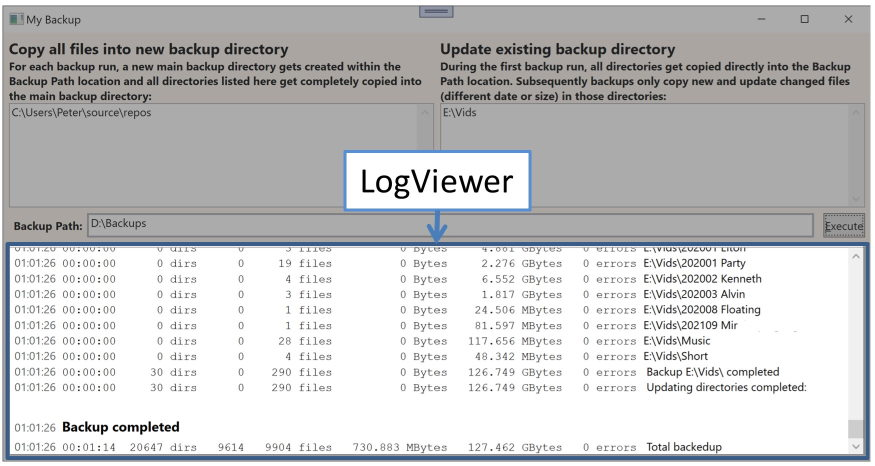

# LogViewer


*LogViewer* is a WPF control which displays logging information in a 
*RichTextBox*, scrolling always to the end of the content. *LogViewer* 
can also display temporary content, which gets overwritten as soon 
permanent content gets written. Use Case: A program has to process 
all files of a directory. In the end, only some directory statistics 
needs to get displayed to the user, but during the processing, 
*LogViewer* should display the name of each file currently 
processed. If several files get processed within 100 
milliseconds, only 1 name gets actually written to the *LogViewer*. 
It would not make sense to update *LogViewer* every few milliseconds, 
WPF would be too slow to perform so many updates and the user could 
anyway not see them. Instead *LogViewer* collects all information, but passes it 
on only every 100 milliseconds to the WPF thread. If there is now a 
file that needs seconds for processing, the user can actually see 
which file takes that long.

The Write methods for *LogViewer* are multithreading safe. To keep 
WPF responsive, one often has to do processing on a different 
threat. The code of this thread does not need to know how to 
write bold or use different fonts. Instead, the class *StyledString* 
defines certain styles and the code activates them like this:

```csharp
logViewer.WriteTempLine("some content temporarily displayed to user");
logViewer.WriteLine("This is a Title", StringStyleEnum.header1);
LogViwere.WriteLine("Some text without formatting.");
```

It is recommended to just copy the 2 files *LogViewer.cs* and 
*StyledString.cs* into your application and then change according 
to your needs. Add the different formatting you need to 
*StringStyleEnum* in *StyledString.cs*:

```csharp
public enum StringStyleEnum {
  none = 0,
  normal,
  label,
  header1,
  errorHeader,
  errorText,
}
```

You also need to update the *switch* statement in the method 
`StyledString.ToInline(Paragraph styledParagraph, string 

lineString, StyledString styledString)`. You need to add one
*case* for every value you added to *StringStyleEnum*:

```csharp
case StringStyleEnum.errorHeader:
  styledParagraph.Margin = new Thickness(0, 24, 0, 4);
  inline = new Bold(new Run(lineString));
  inline.FontSize = styledParagraph.FontSize * 1.2;
  inline.Foreground = Brushes.Red;
  break;
```

For design details and more details see my article on CodeProject:
https://www.codeproject.com/Articles/5340961/LogViewer-A-fast-WPF-Control-displaying-logging-in


